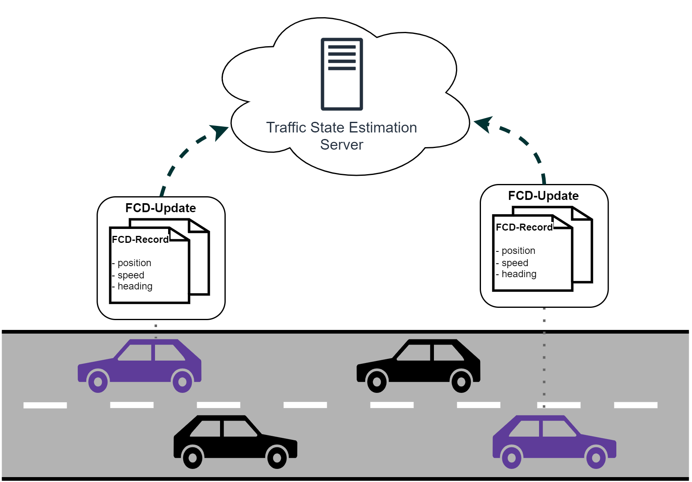

# Traffic State Estimation Applications for Eclipse MOSAIC

This repository contains applications for Floating Car Data (FCD) based Traffic State Estimation (TSE) to be used with
[Eclipse MOSAIC](https://eclipse.dev/mosaic).
Included metrics are partly based on a paper by Yoon et al.[^1].
Furthermore, we provide additional MOSAIC configuration files to be used with the 
[BeST Scenario](https://github.com/mosaic-addons/best-scenario)[^2], to reproduce and validate results and develop your own TSE metrics.

## Documentation
<p align="center"></p>

The picture above depicts the fundamental structure and functioning of this application suite.
The functionality is split across two applications `TseServerApp` and the `FcdTransmitterApp`.
The `FcdTransmitterApp` is a vehicle application that will periodically send FCD messages to the `TseServerApp`.
The server application is responsible for processing received FCD.

The repository is structured into two main packages, `com.dcaiti.mosaic.app.fxd` and `com.dcaiti.mosaic.app.tse` trying to separate
code that is concerned with the transmission and reception of messages (i.e., FCD) and code that is concerned with measuring the traffic
state from the received FCD (i.e., TSE).

### Usage
If this is your first time encountering Eclipse MOSAIC, please refer to the [Documentation](https://eclipse.dev/mosaic/docs/) and
[Tutorials](https://eclipse.dev/mosaic/tutorials/) to get a grasp of MOSAICs' core functionalities and working principles.

To use the applications, you need to build them with [Maven](https://maven.apache.org/) by calling the following command
in the root directory of this repository: 
```shell
mvn clean install
```
This will download all required dependencies and package the applications into a jar file (`traffic-state-estimation-<version>.jar`).
To use the allplications with your scenario, copy the generated jar-file from the `target` directory to the `application` 
directory of your scenario and follow the subsequent steps to properly configure all simulators accordingly. 

**Mapping**

To deploy the applications with your scenario, you need to adjust the *mapping_config.json* accordingly.
Below is an exemplary configuration that you can adjust to your needs. Additionally, the bundled mapping file 
([configs/best-scenario/mapping/mapping_config.json](configs/best-scenario/mapping/mapping_config.json))
can be used directly in conjunction with the BeST Scenario.
```json
{
    "prototypes": [
        {
            "name": "YourSumoVehicleType",
            "applications": [
                "com.dcaiti.mosaic.app.fxd.FcdTransmitterApp"
            ],
            "weight": 1.0
        },
        {
            "name": "YourMosaicPrototype"
        }
    ],
    "vehicles": [
        {
            "startingTime": "1 s",
            "maxNumberVehicles": 1,
            "route": "0",
            "types": [
                {
                    "name": "YourMosaicPrototype",
                    "applications": [
                        "com.dcaiti.mosaic.app.fxd.FcdTransmitterApp"
                    ]
                }
            ]
        }
    ],
    "servers": [
        {
            "name": "TrafficStateEstimationServer",
            "group": "YourServerGroup",
            "applications": [
                "com.dcaiti.mosaic.app.tse.TseServerApp"
            ]
        }
    ]
}
```

**Cell Simulator**

Additionally, when using servers with MOSAICs cell simulator, you need to adjust the *network.json* and configure the server group.
Below is an example of how this could look like. This can also be found in [configs/best-scenario/cell/network.json](configs/best-scenario/cell/network.json).

```json
{
    ...
    "servers": [
        {
            "id": "SampleServer",
            "uplink": {
                "delay": {
                    "type": "ConstantDelay",
                    "delay": "1 ms"
                },
                "transmission": {
                    "lossProbability": 0.0
                }
            },
            "downlink": {
                "unicast": {
                    "delay": {
                        "type": "ConstantDelay",
                        "delay": "1 ms"
                    },
                    "transmission": {
                        "lossProbability": 0.0
                    }
                }
            }
        }
    ]
}
```

**Application Configuration**

There are two application configuration files to consider for the application suite, *FcdTransmitterApp.json* and the *TseServerApp.json*,
which are used to configure the vehicles and the server respectively. 

*FcdTransmitterApp.json*
```json
{
    "receiverId" : "server_0",
    "collectionInterval": "1s",
    "transmissionInterval": "30s"
}
```

*TseServerApp.json*
```json
{
      "fcdDataStorage": {
        "type": "FcdDatabaseHelper",
        "inMemory": false
    },
    "databasePath": null,
    "databaseFileName": null,
    "isPersistent": false,
    "unitRemovalInterval" : "60min",
    "unitExpirationTime" : "30min",
    "traversalBasedProcessors": [
        {
            "type": "SpatioTemporalProcessor",
            "spatialMeanSpeedChunkSize": "15m"
        }
    ],
    "timeBasedProcessors": [
        {
            "type": "ThresholdProcessor",
            "triggerInterval": "30min",
            "defaultRedLightDuration": "45s",
            "minTraversalsForThreshold": 10,
            "recomputeAllRtsmWithNewThreshold": false
        }
    ]
}
```

**Write all FCD into the database**
For different purposes it can be useful to write all received FCD Records into the database.
To achieve this, you can add the `FcdWriterProcessor` to your list of `timeBasedProcessors`.

```json
{
    "timeBasedProcessors": [
        {
            "type": "FcdWriterProcessor",
            "triggerInterval": "30min"
        }
    ]
}
```

## Evaluation Utilities
Within the **evaluation** directory, we bundled python scripts for reading and preprocessing simulation data.
The [**usage_example**](evaluation/notebooks/usage_example.ipynb) Jupyter Notebook should explain the usage of the methods.

You can install required dependencies by generating a virtual environment and calling the following command:
```shell
python -m pip install -r requirements.txt
```

[^1]: Yoon, Jungkeun; Noble, Brian; Liu, Mingyan. *Surface street traffic estimation*. In: Proceedings of the 5th international conference on Mobile systems, applications and services. 2007. S. 220-232
[^2]: Schrab, K., Protzmann, R., Radusch, I. (2023). *A Large-Scale Traffic Scenario of Berlin for Evaluating Smart Mobility Applications*. In: Nathanail, E.G., Gavanas, N., Adamos, G. (eds) Smart Energy for Smart Transport. CSUM 2022. Lecture Notes in Intelligent Transportation and Infrastructure. Springer, Cham. https://doi.org/10.1007/978-3-031-23721-8_24
